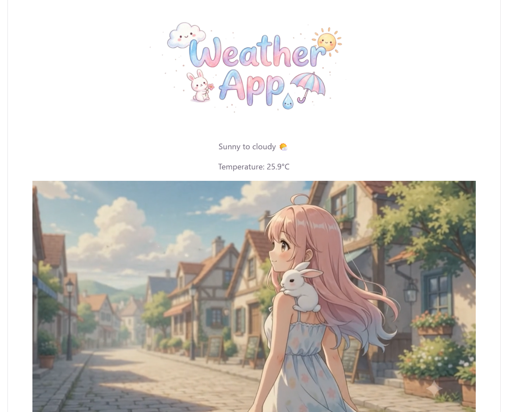

# Weather App 🌤️




*※ サンプル表示です。 / Sample screen.*

現在地の天気に合わせて、画面の世界そのものが変わる React 製の天気アプリ。
天気ごとにアニメーション動画・BGM・イラストが切り替わり、雰囲気ごと体験できる。

A React weather app where the whole screen changes with your local weather.
More than just a forecast — the background animation, BGM, and illustrations
all switch depending on the weather, so you can *feel* it, not just read it.


---

## ✨ 特徴 / Features

| 日本語 | English |
|---|---|
| 現在地を自動取得して天気を表示 | Auto-detects your location and shows local weather |
| 天気で背景アニメ動画を出し分け（快晴・晴れ〜曇り・曇り・雨） | Switches background animation video by weather (clear / partly cloudy / cloudy / rain) |
| ピアノBGMをボタンでオン／オフ | Toggle piano BGM on/off with a button |
| パステル調のオリジナルロゴ・イラスト | Original pastel-style logo and illustrations |

## 🛠 使用技術 / Tech Stack

- **React** (Vite)
- **useState / useEffect** — 状態管理と初回データ取得 / state & initial data fetch
- **Geolocation API** — 現在地の緯度・経度を取得 / get current latitude & longitude
- **Open-Meteo API** — 天気コード・気温を取得（登録不要・無料）/ fetch weather code & temperature (free, no key)
- 天気コードによる条件分岐で動画・テキストを出し分け / conditional rendering by weather code

## 📡 データの流れ / Data Flow

```
Geolocation (get location)
   ↓ latitude / longitude
Open-Meteo API
   ↓ weather code / temperature
Judge by weather code
   ↓
Show matching video / weather name / temperature
```

## 🚀 起動方法 / Getting Started

```bash
npm install
npm run dev
```

表示された `localhost` の URL をブラウザで開き、位置情報を「許可」してください。
Open the `localhost` URL shown, and allow location access.

## 🔒 セキュリティ対策 / Security

フロントエンド完結のアプリだが、公開する以上、意図しない読み込みや情報の扱いに配慮している。
Even as a front-end-only app, once published it should control what it loads and how it handles data.

- **CSP (Content Security Policy)** — `index.html` にCSPを設定し、スクリプト・画像・通信の読み込み元を自サイトと天気API（Open-Meteo）に限定。XSS・不正な外部通信・クリックジャッキング（`frame-ancestors 'none'`）を抑止。
  Restricts scripts / images / network requests to this site and the weather API only, mitigating XSS, unauthorized external requests, and clickjacking.
- **位置情報の扱い / Location privacy** — 取得した緯度・経度は天気APIへの問い合わせにのみ使用し、外部への送信・保存はしない。
  The obtained latitude/longitude is used only to query the weather API — never sent elsewhere or stored.
- **HTTPS通信 / HTTPS** — APIはHTTPSで通信。ホスティング（Vercel）もHTTPSを強制。
  The API is called over HTTPS; hosting (Vercel) also enforces HTTPS.
- **依存パッケージの点検 / Dependency check** — `npm audit` で既知の脆弱性を定期的に確認。
  Regularly checks for known vulnerabilities with `npm audit`.

## 📝 今後の拡張予定 / Roadmap

- タイトルに地名を自動表示（逆ジオコーディング）/ Show place name (reverse geocoding)
- 数日先までの予報 / Multi-day forecast
- お気に入りの地点を保存 / Save favorite locations
